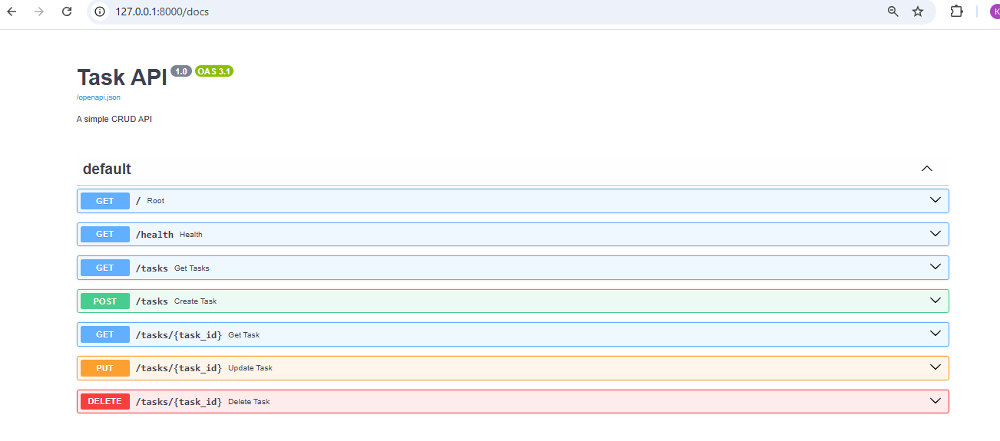

# Task API

A simple CRUD API built with FastAPI and SQLite.

## Features

- Create tasks
- Read all tasks
- Read a single task
- Update tasks
- Delete tasks
- Data persists after server restarts using SQLite

## Technologies

- Python
- FastAPI
- SQLite
- sqlite3

## Why SQLite?

SQLite was chosen because it is lightweight, requires no installation, and stores all data in a single database file. It is perfect for small backend projects and learning SQL.

## Database

The database file is stored in the project folder:

```
tasks.db
```

The application automatically:

- creates the database if it doesn't exist
- creates the `tasks` table if missing
- inserts three sample tasks on the first run only

## Running the project

Create a virtual environment:

```bash
python -m venv venv
```

Activate it:

### Windows PowerShell

```bash
.\venv\Scripts\Activate.ps1
```

Install dependencies:

```bash
pip install fastapi uvicorn
```

Run the API:

```bash
uvicorn main:app --reload
```

Open Swagger UI:

```
http://127.0.0.1:8000/docs
```

## Example SQL Query

```sql
SELECT * FROM tasks;
```

## Screenshots

### Swagger UI



### SQLite Database

(Add your SQLite database screenshot here.)
